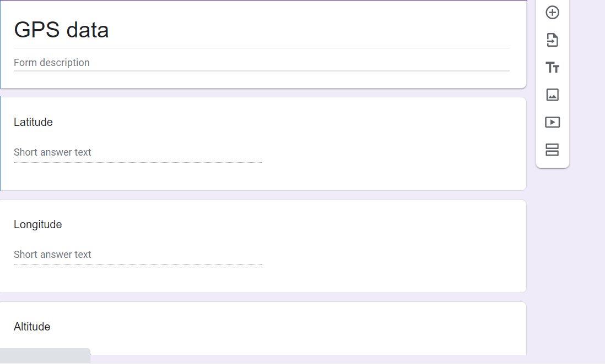

# Software
There are a few components to the software side of this project. There is the code to interface with the GPS, the code to talk to Helium, the code to talk to Tableau and the use of Tableau to chart the data. We wrote small snippets of code to adjust existing functionality to our needs; we've incldued the libraries needed just in case by the time anyne else tries this, something new has changed. For example, the IBM LMIC Framework library should be version 1.5.0+arduino-2, as opposed to the 1.5.1 version (the new version drastically changes code used to select the transmission band).

## GPS
For reading the GPS data we use an existing library for Arduino-like devices called TinyGPS Plus Plus. It shows up in the library manager in the Arduino IDE as TinyGPSPlus version 1.0.3. To use it, we include the .h file:

```c
#include <TinyGPS++.h>
```

We then define the Baud rate, i.e. the speed of transmission. The GPS we have works at 9600. Also declare a gps object

```c
static const uint32_t GPSBaud = 9600;
TinyGPSPlus gps;
```

In the setup section of the arduino code, we begin Serial 1 at the GPS's baud rate:

```c
Serial1.begin(GPSBaud);
```

Feeding the TinyGPSPlus object with new data is simple:

```c
if (Serial1.available()){
    gps.encode(Serial1.read());
}
```

From there, we can query the TinyGPSPlus object for the decoded data:

```c
float lat = gps.location.lat();
float lng = gps.location.lng();
float alt = gps.altitude.meters();
```

There are other useful values that can be extracted, such as HDOP (Horizontal Diultion of Precision, a proxy for the accuracy of the data), the number of satelites involved, the date and time in UTC format, and the heading, but we kept it simple and only got the core data - latitutde, longitude and altitude.

## Feather to Helium
We send data to the [Helium network](https://www.helium.com/), a LoRaWAN network based on its on crypto token, Helium. Basically, we pay a teeny tiny amount per byte. We paid about 50 cents to be able to send roughly 1 million bytes. We needed a standard encoding for our data, and settled on the [Cayenne Low Power Payload](https://www.thethingsindustries.com/docs/integrations/payload-formatters/cayenne/). Basically, we get 1 byte designating the channel (think of it as data packet 1, 2, 3), 1 byte specifying the type of data (i.e. is it current, voltage, gyro data, gps data, etc) and then the data. If we want to expand, we can quickly add new data with this standard encoding. The data is simply sent as an integer in 2s complement. For latitude and longitude we multiply the float by 10,000 to turn it into an integer and we multiply the altitude by 100 to turn it into an integer. Each of the three values occupies three bytes.

There is an arduino Cayene LPP library, so adding our data to an LPP buffer is as simple as:
```c
lpp.addGPS(1, lat, lng, alt);
```
Sending the data is handled by [code provided by Helium](https://docs.helium.com/use-the-network/devices/development/adafruit/adafruit-feather-m0-rfm95/adafruitio/). Don't forget to make a Helium account and follow the [quickstart guide](https://docs.helium.com/use-the-network/console/quickstart)
## Helium to Sheets to Tableau

Helium has an existing integration with google sheets that we use. Basically we make a google form with the fields we want to populate in the sheets document:



Helium will send a POST request with the data extracted from the packets sent by the feather. All we need is a function to decrypt that sequence of bytes. That's faily [easy](https://github.com/ArturoAmaya/CSE145-CatTracker/blob/main/decoder.js). We just take the first two bytes and disregard them (we know it's a GPS), then read the next three bytes and convert into a decimal number for each of the three desired values. 

```javascript
function Decoder(bytes, port) {
    var decoded = {};
    var firstBit;
    // ignore bytes 0 and 1
    // bytes 2, 3, 4 have the latitude
    decoded.latitude = ((bytes[2] << 16) | (bytes[3] << 8) | (bytes[4]));
    firstBit = getFirstBit(bytes[2]);
    if (firstBit){
      decoded.latitude = decoded.latitude - 2**24;
    }
    decoded.latitude = decoded.latitude/10000;
    // bytes 5, 6, 7 have the latitude
    decoded.longitude = ((bytes[5] << 16) | (bytes[6] << 8) | (bytes[7]));
    firstBit = getFirstBit(bytes[5]);
    if (firstBit){
      decoded.longitude = decoded.longitude - 2**24;
    }
    decoded.longitude = decoded.longitude/10000; 
    // bytes 8, 9 and 10 have the altitude
    decoded.altitude = ((bytes[8] << 16) | (bytes[9] << 8) | (bytes[10]));
    firstBit = getFirstBit(bytes[8]);
    if (firstBit){
      decoded.altitude = decoded.altitude - 2**24;
    }
    decoded.altitude = decoded.altitude/100;
    var decodedPayload = {
      "latitude": decoded.latitude,
      "longitude": decoded.longitude,
      "altitude": decoded.altitude
    };
  
    return Serialize(decodedPayload)
  }
  function getFirstBit(byte) {
    return (byte & 0b10000000) >> 7;
  }
```

## Tableau and Plotting